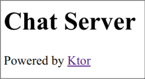
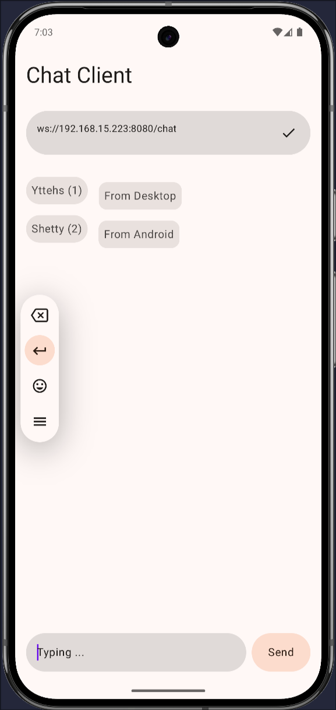
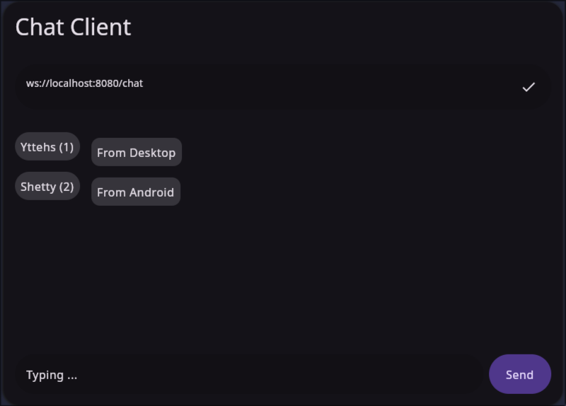

# KMP-Chat

KMP-Chat is a tool for chatting, based on KMP(Kotlin Multiplatform) technology, both client and server are written in Kotlin.

KMP-Chat contains two parts:

- **Server**: WebSocket server
- **Client**: Desktop/Android multiplatform application.

## Usage

### Server

1. Customize the firewall configuration

Open the port 8080 for the server.

```shell
sudo ufw allow 8080
```

2. Run the server

```shell
cd ChatServer
./gradlew :server:run
```

### Client (Desktop)

1. Run the application

```shell
cd ChatClient
./gradlew :client:run
```

2. Input the url of the server, for example: `ws://localhost:8080/chat`

3. Rename your name

Send the command `/name your_name` to the server, for example: `/name Shetty`.

## Screenshots

| Server                                  | Android                             | Desktop                             |
|-----------------------------------------|-------------------------------------|-------------------------------------|
|        |  |  |
| Server is Running (http://0.0.0.0:8080) | Chat with Desktop client            | Chat with Android client            |

## Dependencies

### Server

- Ktor
- Kotlinx Serialization

### Client

- Ktor
- ViewModel Compose
- Koin
- Kotlinx Serialization

## License

MIT